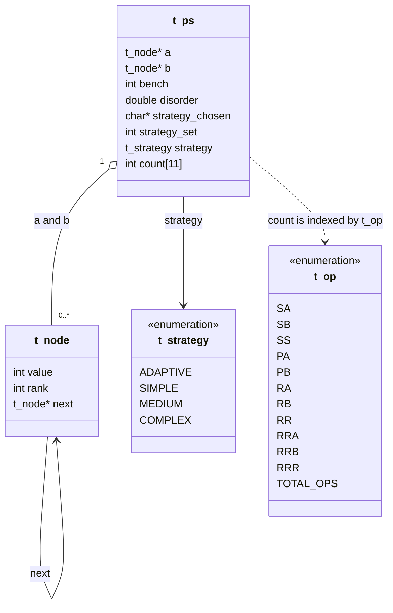
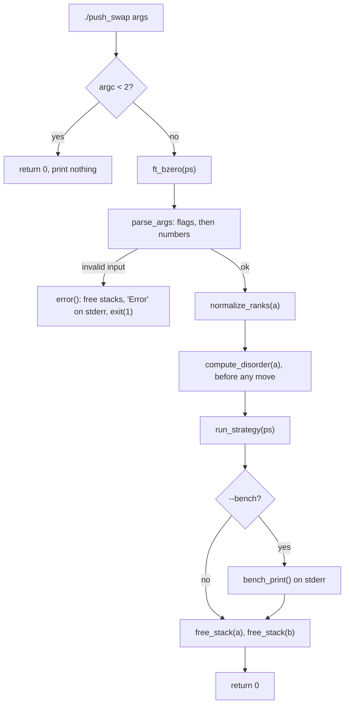
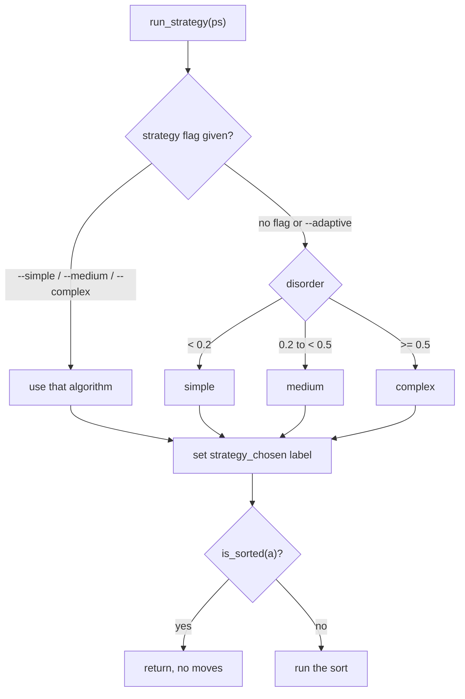
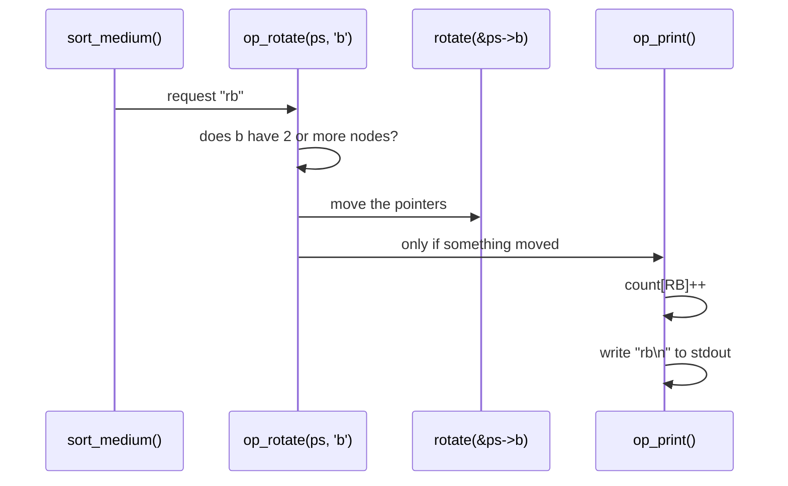
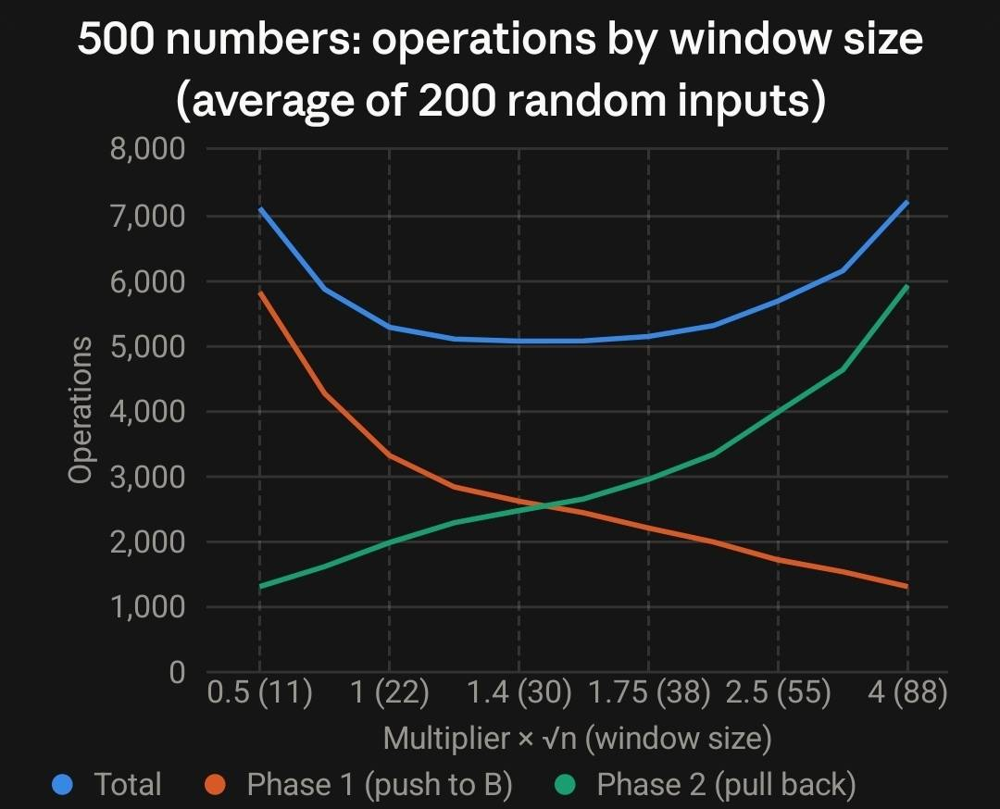

*This activity has been created as part of the 42 curriculum by hal-omar, ayhshala.*

# push_swap

Sort a list of integers using two stacks and a limited set of 11 operations, while printing the shortest list of operations we can find. This version of the project ships four sorting strategies (simple, medium, complex and adaptive), measures how disordered the input is before sorting, and can report detailed statistics with `--bench`.

---

## Table of contents

1. [Description](#description)
2. [Instructions](#instructions)
3. [Input rules and error handling](#input-rules-and-error-handling)
4. [Architecture](#architecture)
5. [The disorder metric](#the-disorder-metric)
6. [Rank normalization](#rank-normalization)
7. [Algorithms](#algorithms)
   - [Simple, O(n²): selection by minimum](#1-simple-on-selection-by-minimum)
   - [Medium, O(n√n): chunk sort](#2-medium-onn-chunk-sort)
   - [Complex, O(n log n): LSD binary radix sort](#3-complex-on-log-n-lsd-binary-radix-sort)
   - [Adaptive: choosing by disorder](#4-adaptive-choosing-by-disorder)
8. [Complexity summary](#complexity-summary)
9. [Benchmarks](#benchmarks)
10. [Bench mode](#bench-mode)
11. [Testing](#testing)
12. [Known limitations and possible improvements](#known-limitations-and-possible-improvements)
13. [Contributions](#contributions)
14. [Resources](#resources)

---

## Description

### The game

There are two stacks, **a** and **b**.

- At the start, **a** holds all the numbers (the first argument is the top) and **b** is empty.
- At the end, **a** must be sorted in ascending order (smallest on top) and **b** must be empty.
- The only way to move numbers is with these 11 operations. Every printed operation counts as one move.

| Op | Effect |
|---|---|
| `sa` | Swap the first two elements of a |
| `sb` | Swap the first two elements of b |
| `ss` | `sa` and `sb` at the same time |
| `pa` | Take the top of b and put it on top of a |
| `pb` | Take the top of a and put it on top of b |
| `ra` | Rotate a: the first element becomes the last |
| `rb` | Rotate b: the first element becomes the last |
| `rr` | `ra` and `rb` at the same time |
| `rra` | Reverse rotate a: the last element becomes the first |
| `rrb` | Reverse rotate b: the last element becomes the first |
| `rrr` | `rra` and `rrb` at the same time |

The program never prints the sorted numbers, only the operations. Its quality is measured by how few operations it prints.

### Goals of this version of the subject

- Implement one algorithm in each complexity class: **O(n²)**, **O(n√n)** and **O(n log n)**, where complexity is counted in **push_swap operations**, not CPU steps.
- Measure the **disorder** of the input before any move.
- Build an **adaptive** strategy that picks an algorithm from the disorder.
- Let the user force a strategy with a flag, and print statistics with `--bench`.
- Reach the performance targets for random input:

| Input | Pass | Good | Excellent | Our medium sort (avg) |
|---|---|---|---|---|
| 100 numbers | < 2000 | < 1500 | < 700 | **576** |
| 500 numbers | < 12000 | < 8000 | < 5500 | **5069** |

---

## Instructions

### Requirements

- A C compiler (`cc`) and `make`
- Linux or macOS
- Optional: `valgrind`, and the `checker_linux` binary from the project page to verify the output

### Build

```sh
make        # builds libft, ft_printf, then push_swap
make clean  # removes object files
make fclean # removes object files and the binaries/libraries
make re     # fclean + make
```

Everything is compiled with `-Wall -Wextra -Werror`. Running `make` twice does not relink.

### Run

```sh
./push_swap [flags] numbers...
```

| Flag | Meaning |
|---|---|
| *(none)* | Same as `--adaptive` |
| `--simple` | Force the O(n²) algorithm |
| `--medium` | Force the O(n√n) algorithm |
| `--complex` | Force the O(n log n) algorithm |
| `--adaptive` | Pick the algorithm from the measured disorder |
| `--bench` | After sorting, print statistics to **stderr** |

Numbers can be passed as separate arguments or inside one quoted string, or both:

```sh
./push_swap 3 2 1
./push_swap "3 2 1"
./push_swap "3 2" 1
```

### Examples

```sh
$ ./push_swap 2 1 3 6 5 8
ra
pb
rra
pb
pb
ra
pb
sa
pa
pa
pa
pa

$ ./push_swap --bench 4 67 3 87 23 > /dev/null
[bench] disorder: 40.00%
[bench] strategy: Adaptive / O(n√n)
[bench] total_ops: 13
[bench] sa: 0 sb: 0 ss: 0 pa: 5 pb: 5
[bench] ra: 0 rb: 2 rr: 0 rra: 0 rrb: 1 rrr: 0

$ ./push_swap 1 2 abc
Error
```

### Checking the result

```sh
ARG=$(shuf -i 0-9999 -n 500 | tr '\n' ' ')
./push_swap $ARG | ./checker_linux $ARG   # prints OK
./push_swap $ARG | wc -l                  # number of operations
```

---

## Input rules and error handling

Our program accepts and rejects input according to these rules. On any error it frees all memory, writes `Error\n` to **stderr**, and exits with status 1. Nothing is ever written to stdout in that case.

### Numbers

| Input | Result | Reason |
|---|---|---|
| `42`, `-42`, `+42`, `007` | valid | one optional sign, then digits |
| `2147483647`, `-2147483648` | valid | `INT_MAX` and `INT_MIN` |
| `"3 2 1"`, `"  3   2 "` | valid | split on spaces |
| `abc`, `12a`, `4-2`, `1.5` | Error | not an integer |
| `+`, `-`, `+-5`, `--5` | Error | sign without digits, or two signs |
| `""`, `"   "` | Error | empty argument |
| `2147483648`, `-2147483649`, `99999999999999999999` | Error | outside the int range |
| `3 2 3`, `0 -0`, `5 +5`, `1 01`, `"1 2" 2` | Error | duplicate value (compared as numbers, not strings) |

Overflow is detected **digit by digit** while converting into a `long`, so even a 30-digit number is rejected before the `long` itself can overflow.

### Flags

These are design decisions; the subject leaves them open.

| Rule | Example | Result |
|---|---|---|
| Flags must come **before** the numbers | `./push_swap 3 1 2 --bench` | Error |
| At most **one** strategy flag | `./push_swap --simple --complex 1 2` | Error |
| `--bench` at most once | `./push_swap --bench --bench 1 2` | Error |
| Unknown flag | `./push_swap --fast 1 2` | Error |
| Flags but no numbers | `./push_swap --bench` | Error |
| One dash is not a flag | `./push_swap -simple 1 2` | Error (not a number) |

### Nothing to do

| Input | Output |
|---|---|
| `./push_swap` (no arguments) | nothing, prompt given back |
| `./push_swap 42` | nothing (already sorted) |
| `./push_swap 1 2 3` | nothing (already sorted) |

---

## Architecture

### File layout

```
push_swap/
├── Makefile
├── README.md
├── push_swap.h              all types and prototypes
├── libft/                   our libft (ft_split, ft_strncmp, ft_bzero, ...)
├── ft_printf/               our ft_printf, extended with ft_dprintf and %f
└── srcs/
    ├── main.c               the pipeline, no logic of its own
    ├── parsing/
    │   ├── parse_args.c     walks argv, separates flags from numbers
    │   ├── parse_flags.c    recognizes the 5 flags
    │   ├── parse_number.c   splits an argument, converts and stores each number
    │   ├── parse_validate.c syntax check, safe atol, duplicate check
    │   └── error.c          single error exit: free, print, exit
    ├── stack/
    │   └── stack_utils.c    new_node, stack_add_bottom, free_stack, stack_size, is_sorted
    ├── analysis/
    │   ├── ranks.c          values -> ranks 0..n-1
    │   └── disorder.c       the disorder metric
    ├── ops/
    │   ├── ops_swap.c       sa sb ss
    │   ├── ops_push.c       pa pb
    │   ├── ops_rotate.c     ra rb rr
    │   └── ops_reverse.c    rra rrb rrr
    ├── sort/
    │   ├── strategy.c       picks the algorithm, sets the complexity label
    │   ├── sort_simple.c    O(n²)
    │   ├── sort_medium.c    O(n√n)
    │   └── sort_complex.c   O(n log n)
    └── bench/
        └── bench.c          --bench report on stderr
```

Each folder has one responsibility. The sorting algorithms never touch the list pointers directly: they only call the operation functions, which is why the operation counts in `--bench` are always exact.

### Data model (UML)



| Type | Role |
|---|---|
| `t_node` | One number (16 bytes on a 64-bit system). `value` is the original integer; `rank` is its position in sorted order (0 to n−1); `next` is the node below it. |
| `t_ps` | The whole program state, declared once in `main` (no global variables, no `malloc` for it). |
| `t_ps.a`, `t_ps.b` | Pointers to the top node of each stack (`NULL` means empty). |
| `t_ps.bench` | 1 if `--bench` was given. |
| `t_ps.disorder` | Disorder measured before any move, between 0 and 1. |
| `t_ps.strategy` | The strategy requested by the user (`ADAPTIVE` by default). It is never overwritten, so bench can print "Adaptive". |
| `t_ps.strategy_set` | Parsing only: 1 once a strategy flag was seen, so a second one is rejected. |
| `t_ps.strategy_chosen` | The complexity label of the algorithm that actually ran (`"O(n²)"`, `"O(n√n)"`, `"O(n log n)"`), printed by bench. |
| `t_ps.count[]` | One counter per operation, indexed by `t_op`. `TOTAL_OPS` (= 11) is only the array size, never an index. The total is computed by summing the 11 counters. |

**Why a singly linked list?** Push, swap and rotate are a few pointer changes. Reverse rotate and rotate walk to the end of the list, which is O(n) **CPU** time per operation, but this does not change the number of **operations**, which is what the subject measures. For 500 numbers the slowest strategy finishes in about 0.03 s.

### Program workflow



Inside `run_strategy`:



The label is set **before** the sorted check, so `--bench` on an already sorted input still prints a valid strategy line.

### The operations layer

Every operation goes through the same three steps:



Rules shared by all operation files:

- **An operation that cannot move anything prints nothing and counts nothing** (for example `sa` on a stack of one node, or `pa` when b is empty).
- **Combined operations degrade gracefully.** `rr` with only stack a able to rotate rotates a and prints `ra`, not `rr`. The printed line always describes exactly what happened, so the checker and the counters always agree.
- **Functions receive `t_ps *`** because they must modify the head pointers of the stacks, which belong to the caller.

---

## The disorder metric

Disorder measures how far stack a is from sorted, from 0 (sorted) to 1 (fully reversed). It is the fraction of pairs that are in the wrong order (an *inversion* count):

```
mistakes = number of pairs (i, j) with i before j and a[i] > a[j]
total    = n (n - 1) / 2
disorder = mistakes / total
```

Example with `4 67 3 87 23`: the pairs in the wrong order are (4, 3), (67, 3), (67, 23) and (87, 23), so 4 mistakes out of 10 pairs, a disorder of **40.00%**.

- It is computed **after parsing and before any operation**, as the subject requires.
- With fewer than 2 numbers there are no pairs; we return 0 instead of dividing by zero.
- `total` is computed in a `long`, so `n (n − 1)` cannot overflow an `int`.
- Cost: O(n²) CPU time, O(1) extra memory. Random input gives a disorder close to 0.50 (we measured 0.46 to 0.58 for 100 numbers).

**Printing it:** bench prints `disorder × 100` with our `ft_printf`'s `%f`, which prints exactly two decimals. `ft_putdouble` adds 0.005 before cutting the decimals, so the value is rounded instead of truncated (without it, 49.93% printed as 49.92% because a `double` stores 49.93 as 49.9299…).

---

## Rank normalization

Before sorting, every node gets a `rank`: its position in sorted order.

```
values: 42  -7  900  15
ranks :  2   0    3   1
```

`normalize_ranks` counts, for each node, how many values are smaller than it. This is O(n²) CPU time and O(1) extra memory, which is fine for 500 numbers.

Ranks make every algorithm simpler:

- They always go from 0 to n−1, with no gaps and no negative numbers.
- The simple sort knows which rank to look for next (0, then 1, then 2…).
- The chunk sort can talk about windows of ranks ("ranks 0 to 29 first").
- Radix sort needs non-negative integers with a known number of bits.

`value` is kept for the disorder metric, the sorted check and the duplicate check.

---

## Algorithms

All complexities below are counted in **push_swap operations**, which is the model the subject asks for. Each algorithm also uses O(1) extra memory: the nodes are only moved between the stacks, never copied.

### 1. Simple, O(n²): selection by minimum

**Idea:** take the smallest remaining number, bring it to the top of a by the shortest path, push it to b. Repeat. At the end, b holds the numbers from biggest (bottom) to smallest (top), so pushing everything back gives a sorted a.

**Steps** (`sort_simple.c`):

1. `target = 0` (the smallest rank).
2. While a has more than 2 nodes:
   1. Find the position `pos` of `target` in a.
   2. If `pos` is in the top half, `ra` until it is on top; otherwise `rra` until it is on top.
   3. `pb`, then `target++`.
3. The last 2 nodes of a: `sa` if they are in the wrong order.
4. `pa` until b is empty.

**Trace** on `2 0 4 1 3` (10 operations):

```
start a: 2 0 4 1 3    b: -
ra    a: 0 4 1 3 2    b: -        rank 0 is at position 1: one ra
pb    a: 4 1 3 2      b: 0
ra    a: 1 3 2 4      b: 0
pb    a: 3 2 4        b: 1 0
ra    a: 2 4 3        b: 1 0
pb    a: 4 3          b: 2 1 0
sa    a: 3 4          b: 2 1 0    last two nodes
pa    a: 2 3 4        b: 1 0
pa    a: 1 2 3 4      b: 0
pa    a: 0 1 2 3 4    b: -
```

**Complexity:**
- Each extraction needs at most ⌊k/2⌋ rotations on a stack of k elements, plus one `pb`.
- Total rotations ≤ n/2 + (n−1)/2 + … ≈ n²/4, plus n pushes out and n pushes back.
- **Operations: O(n²).** Extra space: O(1).

**When it shines:** when the numbers that must come out next are already near the top or bottom of a. On a reversed list each minimum is at the bottom, so every extraction costs a single `rra` (295 operations for 100 reversed numbers).

### 2. Medium, O(n√n): chunk sort

**Idea:** instead of extracting one number at a time, move numbers to b in **windows of nearby ranks**. b ends up roughly sorted (big ranks near the top), so bringing them back one by one, always taking the maximum, is cheap.

**Steps** (`sort_medium.c`):

The window is `w = ⌊√n⌋ × 1.4` and `pushed` counts how many numbers are already in b.

*Phase 1, a → b:* look at the top of a.

| Top of a has rank… | Action | Why |
|---|---|---|
| `≤ pushed` | `pb`, then `rb` | a small number: send it to the bottom of b |
| `≤ pushed + w` | `pb` | inside the window: keep it near the top of b |
| `> pushed + w` | `ra` | too big for now: look at the next one |

Each `pb` moves the window up by one (`pushed++`).

*Phase 2, b → a:* until b is empty, find the position of the biggest rank in b, bring it to the top with `rb` or `rrb` (shortest direction), then `pa`. The numbers arrive in a from biggest to smallest, so a ends sorted.

**Trace** on `2 0 4 1 3` (n = 5, ⌊√5⌋ = 2, w = 2; 15 operations):

```
start a: 2 0 4 1 3    b: -
pb    a: 0 4 1 3      b: 2            rank 2 <= 0+2: in the window
pb    a: 4 1 3        b: 0 2          rank 0 <= 1: small...
rb    a: 4 1 3        b: 2 0          ...so it goes to the bottom of b
pb    a: 1 3          b: 4 2 0        rank 4 <= 2+2
pb    a: 3            b: 1 4 2 0
rb    a: 3            b: 4 2 0 1
pb    a: -            b: 3 4 2 0 1
rb    a: -            b: 4 2 0 1 3
--- phase 2: always pull the maximum
pa    a: 4            b: 2 0 1 3
rrb   a: 4            b: 3 2 0 1
pa    a: 3 4          b: 2 0 1
pa    a: 2 3 4        b: 0 1
rb    a: 2 3 4        b: 1 0
pa    a: 1 2 3 4      b: 0
pa    a: 0 1 2 3 4    b: -
```

**Complexity argument (upper bounds):**

- *Phase 1.* When the window is `[0, pushed + w]`, it covers `pushed + w + 1` ranks, of which only `pushed` have left a, so **at least `w + 1` numbers in a are inside the window** (or all that remain). The window only grows, so one full turn around a (at most n `ra`) pushes at least w + 1 numbers. Phase 1 therefore needs at most about n / w full turns: **O(n² / w) rotations**, plus at most 2n pushes and `rb`.
- *Phase 2.* Phase 1 leaves b in a predictable shape. Numbers pushed without `rb` pile up on top in push order, and push order follows the window, so their ranks increase towards the top with a jitter of at most w: a number pushed on top of a rank `m` had a rank above `pushed ≥ m − w`. Numbers sent down with `rb` pile up at the bottom in the same way. So b is high at both ends and low in the middle, and the current maximum is always within about w positions of the top or of the bottom. Pulling it out the short way costs **O(w)** rotations, so phase 2 costs **O(n · w)**.
- *Total:* O(n²/w + n·w). With `w = c·√n` this is **O(n√n · (1/c + c))** = **O(n√n)** for any constant c.
- Extra space: O(1).

#### Why the window is 1.4 × √n

The bound above already shows the trade-off: phase 1 costs about `1/c` and phase 2 costs about `c` (times n√n). A small window makes many passes over a; a big window makes b messy, so finding the maximum costs more. The constant c only changes the number of operations, never the complexity class, so we chose it **by measurement**.

We simulated the algorithm on 200 random inputs for each value of c:



| c (× √n) | window (n=500) | Phase 1 | Phase 2 | **Total (500)** | **Total (100)** |
|---|---|---|---|---|---|
| 0.5 | 11 | 5804 | 1295 | 7099 | 727 |
| 0.75 | 16 | 4274 | 1596 | 5870 | 645 |
| 1.0 | 22 | 3306 | 1970 | 5277 | 594 |
| 1.25 | 27 | 2826 | 2261 | 5088 | 579 |
| **1.4** | **30** | **2607** | **2447** | **5054** | **578** |
| 1.6 | 35 | 2322 | 2750 | 5072 | 581 |
| 1.75 | 38 | 2187 | 2946 | 5133 | 584 |
| 2.0 | 44 | 1977 | 3299 | 5276 | 597 |
| 2.5 | 55 | 1703 | 3959 | 5661 | 633 |
| 3.0 | 66 | 1525 | 4628 | 6153 | 674 |
| 4.0 | 88 | 1293 | 5910 | 7203 | 754 |

- The two phases pull in opposite directions (orange falls, green rises), exactly as the bound predicts.
- The total is lowest where the two costs balance. For 100 numbers they are **equal at c = 1.4** (289 and 289 operations).
- **c = 1.4 gives the lowest total for 500 numbers** and is within 1 operation of the best for 100 numbers. It keeps both sizes under the "excellent" limits (700 and 5500).
- The curve is flat between about 1.25 and 1.75, so the result is not fragile.

In the code, the window is `int_sqrt(size) * 1.4`, converted to an integer.

### 3. Complex, O(n log n): LSD binary radix sort

**Idea:** sort the ranks one bit at a time, starting from the least significant bit (LSD). For each bit, every number whose bit is 0 goes to b and every number whose bit is 1 stays in a; then everything comes back. After the last bit, a is sorted.

**Steps** (`sort_complex.c`):

```
bits = number of bits needed for (n - 1)
for bit = 0 to bits - 1:
    repeat n times:
        if bit of top(a).rank is 0 → pb
        else                       → ra
    pa until b is empty
```

**Why it works:** after a pass, a contains first all the numbers with bit 0 then all the numbers with bit 1, **each group in its previous order**. The 1s stay in order in a; the 0s are reversed once when pushed into b and reversed again when pushed back. This stability is what makes LSD radix sort correct: after processing bit k, a is sorted by the last k + 1 bits.

**Trace** on `2 0 4 1 3` (ranks in binary: 2=010, 0=000, 4=100, 1=001, 3=011; 3 bits; 25 operations):

```
bit 0: 2:pb 0:pb 4:pb 1:ra 3:ra, then pa pa pa   →  a: 2 0 4 1 3
bit 1: 2:ra 0:pb 4:pb 1:pb 3:ra, then pa pa pa   →  a: 0 4 1 2 3
bit 2: 0:pb 4:ra 1:pb 2:pb 3:pb, then pa pa pa pa →  a: 0 1 2 3 4
```

**Complexity:**
- Passes: ⌈log₂ n⌉ (7 for 100 numbers, 9 for 500).
- Each pass: exactly n operations (`pb` or `ra`) plus one `pa` per 0 bit, so at most 2n.
- **Operations: O(n log n)**, at most 2n⌈log₂ n⌉. Extra space: O(1).

The number of operations does not depend on the input order at all: for ranks 0 to n−1 it is always n·bits + (number of 0 bits), which gives **1084** for 100 numbers and **6784** for 500. Its strength is predictability: random or adversarial input never makes it worse.

### 4. Adaptive: choosing by disorder

```
if a strategy flag was given  → use it
else if disorder < 0.2        → simple   O(n²)
else if disorder < 0.5        → medium   O(n√n)
else                          → complex  O(n log n)
```

**Rationale for the thresholds.** The subject fixes the three regimes and the complexity class required in each one. Our job was to choose a technique for each regime and justify it:

| Regime | Technique | Why |
|---|---|---|
| **Low** (< 0.2) | Selection by minimum | Few inversions means the next minimum is often close to an end of a, so extractions need few rotations. Its cost grows with the disorder, which is why it is reserved for the low regime. |
| **Medium** (0.2 to 0.5) | Chunk sort | Its cost grows smoothly with disorder (395 ops at 0.21 to 585 ops at 0.50 for 100 numbers) and stays well below radix. |
| **High** (≥ 0.5) | Radix sort | Its cost is fixed and independent of the order, so it gives a hard upper bound for the most chaotic inputs. |

**Complexity per regime (operations, upper bounds):**

| Regime | Time | Extra space |
|---|---|---|
| Low | O(n²) | O(1) |
| Medium | O(n√n) | O(1) |
| High | O(n log n) | O(1) |

Before choosing, the program also pays for parsing, ranks and disorder: O(n²) CPU time each (the duplicate check, the rank count and the pair count each compare every pair), but **zero operations**. Total memory is O(n): one 16-byte node per number.

**Why ≥ 0.5 matters in practice:** random input has a disorder very close to 0.50, so half of random inputs go to medium and half to complex. Both must therefore meet the performance targets, and they do (see [Benchmarks](#benchmarks)).

---

## Complexity summary

| Algorithm | Operations (time) | Extra memory | 100 random (avg) | 500 random (avg) |
|---|---|---|---|---|
| Simple | O(n²) | O(1) | 1453 | 32133 |
| Medium | O(n√n) | O(1) | 576 | 5069 |
| Complex | O(n log n) | O(1) | 1084 | 6784 |
| Adaptive | per regime above | O(1) | 845 | 5980 |
| Disorder metric | 0 operations, O(n²) CPU | O(1) | | |
| Rank normalization | 0 operations, O(n²) CPU | O(1) | | |

---

## Benchmarks

All numbers below come from the real program, verified sorted on every run.

### Random input

Averages over 60 random inputs for 100 numbers and 30 for 500 numbers (values between −10000 and 10000).

| Strategy | 100 avg | 100 max | 500 avg | 500 max |
|---|---|---|---|---|
| `--simple` | 1453 | 1624 | 32133 | 34140 |
| `--medium` | **576** | 619 | **5069** | 5239 |
| `--complex` | 1084 | 1084 | 6784 | 6784 |
| adaptive (default) | 845 | 1084 | 5980 | 6784 |

### Effect of disorder

Inputs built from a sorted list with random swaps until the target disorder is reached (average of 5 inputs per row).

**100 numbers**

| Disorder | simple | medium | complex |
|---|---|---|---|
| 0.05 | 317 | 249 | 1084 |
| 0.12 | 568 | 299 | 1084 |
| 0.18 | 701 | 368 | 1084 |
| 0.31 | 1100 | 497 | 1084 |
| 0.51 | 1446 | 579 | 1084 |
| 1.00 (reversed) | 295 | 663 | 1084 |

**500 numbers**

| Disorder | simple | medium | complex |
|---|---|---|---|
| 0.05 | 4283 | 1412 | 6784 |
| 0.10 | 8008 | 2218 | 6784 |
| 0.15 | 11724 | 2765 | 6784 |
| 0.30 | 23245 | 4070 | 6784 |
| 0.50 | 32277 | 5027 | 6784 |
| 1.00 (reversed) | 1495 | 5734 | 6784 |

What we learned from this table is discussed honestly in [Known limitations](#known-limitations-and-possible-improvements).

---

## Bench mode

With `--bench`, after sorting, the program prints to **stderr** (file descriptor 2), so the operations on stdout stay clean for the checker:

```
[bench] disorder: 40.00%
[bench] strategy: Adaptive / O(n√n)
[bench] total_ops: 13
[bench] sa: 0 sb: 0 ss: 0 pa: 5 pb: 5
[bench] ra: 0 rb: 2 rr: 0 rra: 0 rrb: 1 rrr: 0
```

| Line | Source |
|---|---|
| disorder | `ps->disorder × 100`, measured before any move, two decimals |
| strategy | the name the user asked for (`Adaptive` by default), then the class of the algorithm that actually ran |
| total_ops | sum of the 11 counters |
| op counts | `ps->count[SA]` … `ps->count[RRR]` |

We extended our ft_printf for this: `ft_dprintf(fd, ...)` writes to any file descriptor, and `%f` prints a double with two rounded decimals.

```sh
./push_swap --bench $ARG 2> bench.txt | ./checker_linux $ARG   # OK, report saved in bench.txt
```

---

## Testing

```sh
# correctness and operation count for every strategy
for f in --simple --medium --complex --adaptive; do
  ARG=$(shuf -i 0-9999 -n 500 | tr '\n' ' ')
  echo "$f: $(./push_swap $f $ARG | ./checker_linux $ARG) $(./push_swap $f $ARG | wc -l)"
done

# small sizes: every flag must work regardless of size
for n in 1 2 3 5; do ARG=$(shuf -i 0-99 -n $n | tr '\n' ' '); ./push_swap --simple $ARG | ./checker_linux $ARG; done

# stdout only contains operations, stderr only contains the bench
./push_swap --bench 3 1 2 2>/dev/null
./push_swap --bench 3 1 2 >/dev/null

# memory: success path and error path
valgrind --leak-check=full ./push_swap --bench $ARG > /dev/null
valgrind --leak-check=full ./push_swap 1 2 abc
```

We checked: every strategy on sizes 1, 2, 3, 5, 100 and 500, on random, sorted, reversed and nearly sorted input; every error case in the tables above; valgrind reports 0 leaks and 0 errors on both success and error paths.

```sh
norminette srcs push_swap.h libft ft_printf
```

---

## Known limitations and possible improvements

We prefer to state these clearly rather than hide them.

1. **The simple sort is rarely the cheapest, even at low disorder.** The disorder table shows that for most inputs below 0.2, medium uses fewer operations than simple, and for 500 numbers at disorder 0.15 to 0.2 simple can exceed 12000 operations. We kept simple in the low regime because the subject asks for an O(n²) method there, and because it is very cheap when the misplaced numbers are close to the ends of the stack (for example 218 operations for 100 numbers with 2 swapped pairs, against 394 for medium). Since O(n√n) is also within O(n²), a future version could use the chunk sort in the low regime too, or improve simple by extracting the minimum *or* the maximum, whichever is closer.
2. **No special sorts for 3 or 5 numbers.** Small inputs are always sorted correctly by the general algorithms, but not with the minimum number of operations (radix can use 10 operations on 3 numbers, where 2 are always enough). A hard-coded sort for n ≤ 5 would fix this without changing any complexity class.
3. **Reversed input goes to radix.** A fully reversed list has disorder 1.0, so adaptive picks radix (6784 operations for 500), although simple would need only 1495. Detecting this special case would be easy.
4. **Combined operations are not exploited.** The algorithms never ask for `ss`, `rr` or `rrr` on purpose; merging a pending `ra` and `rb` into one `rr` would save operations in the chunk sort.
5. **CPU cost of the singly linked list.** Rotations walk to the end of the list. This costs CPU time but never extra operations; for 500 numbers the program still finishes in about 0.03 s.

---

## Contributions

Both of us designed the data structures, the file layout and the adaptive rules together, reviewed each other's code, and can explain every part of the project.

| Area | hal-omar | ayhshala |
|---|---|---|
| Project setup: repository, folder structure, Makefile, header | ✔ | |
| Operations layer: push, swap, rotate, reverse rotate, counters | ✔ (first versions, counters, printing) | ✔ (refactor into shared helpers, edge cases) |
| Parsing: flags, numbers, syntax, overflow, duplicates | | ✔ |
| Error handling and memory cleanup | | ✔ |
| Stack utilities (`new_node`, `stack_add_bottom`, `free_stack`, `stack_size`) | | ✔ |
| `is_sorted` | ✔ | |
| Rank normalization | ✔ (integration) | ✔ (algorithm) |
| Disorder metric | ✔ | |
| Simple sort, O(n²) | | ✔ |
| Medium chunk sort, O(n√n), and window tuning | ✔ | |
| Complex radix sort, O(n log n) | | ✔ |
| Strategy dispatcher (`run_strategy`, adaptive thresholds) | ✔ | |
| Bench mode, `ft_dprintf` and `%f` in ft_printf | ✔ | |
| Testing, benchmarks, README | ✔ | ✔ |

---

## Resources

### References

- The push_swap subject (42 curriculum).
- T. H. Cormen, C. E. Leiserson, R. L. Rivest, C. Stein, *Introduction to Algorithms*, 3rd ed., MIT Press: chapter 2 (insertion and selection sort analysis), chapter 3 (asymptotic notation), chapter 8 (counting sort and radix sort, stability).
- Wikipedia, [Selection sort](https://en.wikipedia.org/wiki/Selection_sort).
- Wikipedia, [Radix sort](https://en.wikipedia.org/wiki/Radix_sort) (LSD vs MSD, why stability matters).
- Wikipedia, [Bucket sort](https://en.wikipedia.org/wiki/Bucket_sort) (the idea behind splitting into about √n groups).
- Wikipedia, [Inversion (discrete mathematics)](https://en.wikipedia.org/wiki/Inversion_(discrete_mathematics)) (our disorder metric is the normalized inversion count).
- Wikipedia, [Big O notation](https://en.wikipedia.org/wiki/Big_O_notation).
- [Valgrind user manual](https://valgrind.org/docs/manual/manual.html).
- [GNU make manual](https://www.gnu.org/software/make/manual/make.html).
- [push_swap visualizer by o-reo](https://github.com/o-reo/push_swap_visualizer), useful to watch the algorithms run.

### How we used AI

We used an AI assistant (Claude) as a tutor and reviewer, and kept every design decision ourselves. Everything that came from it was read, traced by hand on paper, tested, and is understood by both of us.

| Task | What the AI did | What we did |
|---|---|---|
| Understanding the subject | Explained the new requirements (disorder, strategies, bench) and drew the overall program flow | Read the subject, chose the design |
| Planning | Proposed a roadmap, a file layout and a way to split the work between two people | Adapted it to our schedule and split |
| C concepts | Explained `*` vs `**`, linked-list pointer updates, out-of-bounds array access, integer-only percentage maths | Wrote the operations and asked for reviews |
| Git | Helped recover from a sparse-checkout mistake and a force-push, and explained branches and commits | Ran and checked every command |
| Code review and debugging | Reviewed our functions, explained compiler and valgrind errors, pointed out bugs (wrong counters, a pointer used as a counter, a missing rounding step) | Fixed them ourselves |
| Medium algorithm | Converted our chunk-sort pseudocode to our data structures, and ran simulations to compare window sizes (the chart and table above) | Traced it by hand, tested it, chose 1.4 from the measurements |
| ft_printf extension | Explained how to add a file-descriptor parameter and two-decimal `%f` | Implemented and tested it |
| Testing | Suggested test commands, error cases and a checker-style test | Ran all tests on our machines |
| This README | Helped draft and structure it from our code and our measurements | Reviewed and corrected it |
